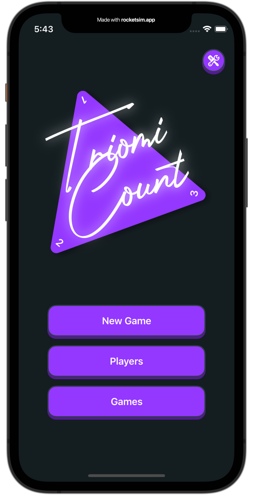
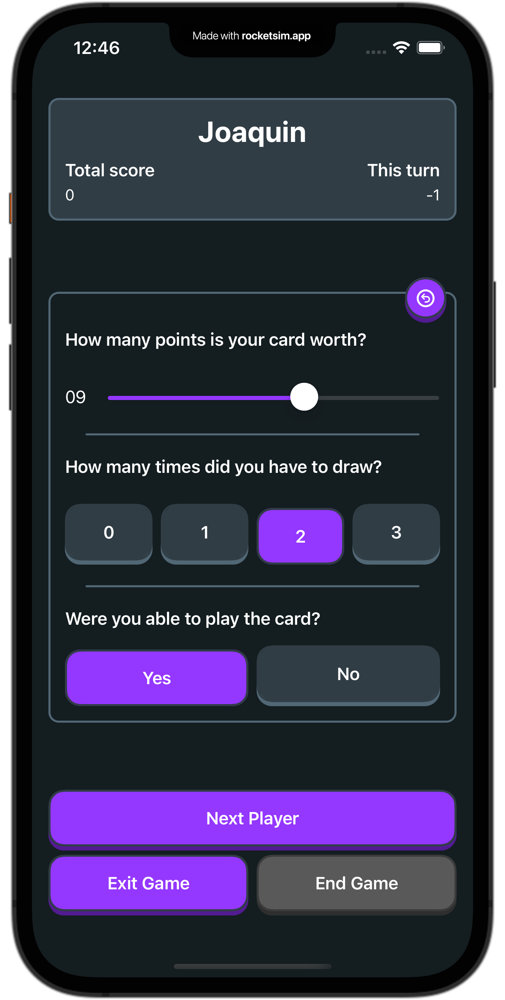
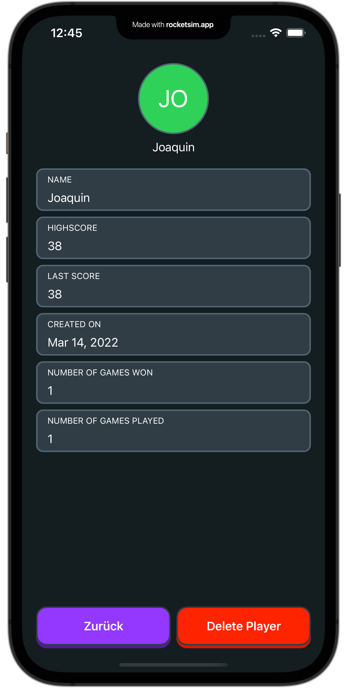

    

# TriomiCount
This is my first bigger project. Currently I'm working on it as my main project, while learning.
TriomiCount is used to track the state of the games while playing the boardgame [Triominoes](https://en.wikipedia.org/wiki/Triominoes).

It basically is a kind of dominoes but with triangle shaped tiles.

## Key features
* add and list players
* show statistics about single players *(e.g. highscores, last score, games played, games won, etc.)*
* track a game of *n* players *(singleplayer games are also possible)*
* look into previous games and its statistics *(work in progress)*

## Screenshots

  
  
  

## 
Me and my wife like playing the game, but I was annoyed that I'd to write down our scores by hand and the next time we'd played, the last scores were gone. Also I was looking for a simple app for learning purpose.
I'm far more interested in building something – atleast for us – useful, than the next to-do app or just follow tutorials. 🙃

## Requirements
* Xcode 13.0+ & Swift 5.5+
* iOS 15.0+

## License
The project is licenced under [GNU General Public License version 2](./LICENSE).
