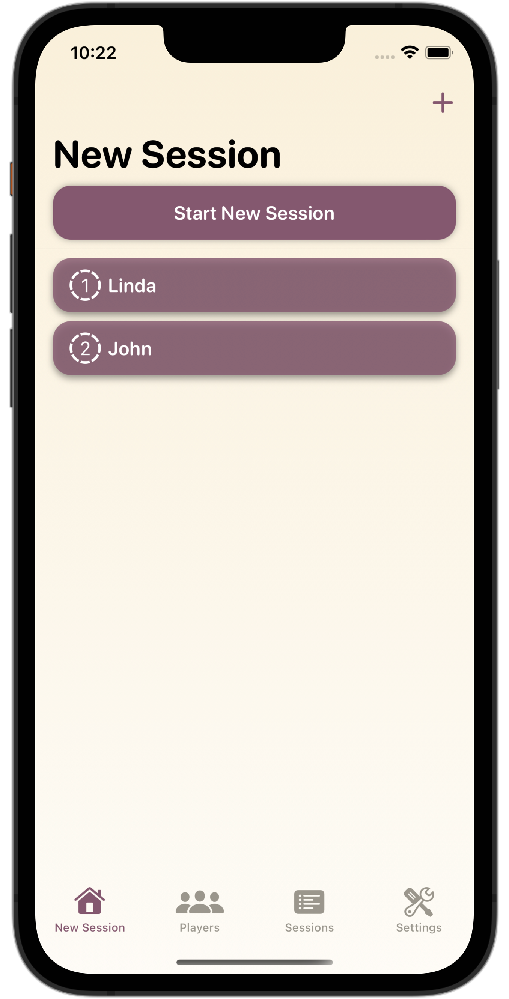
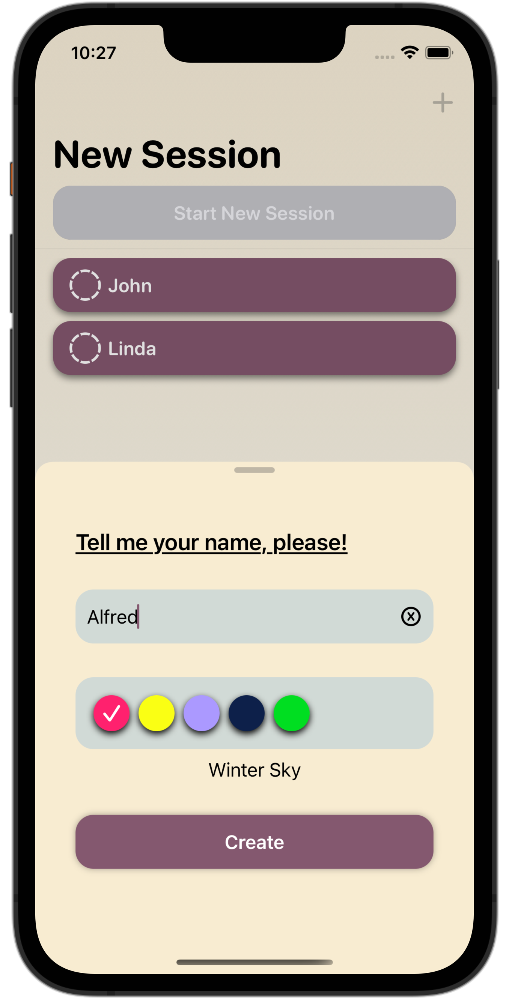
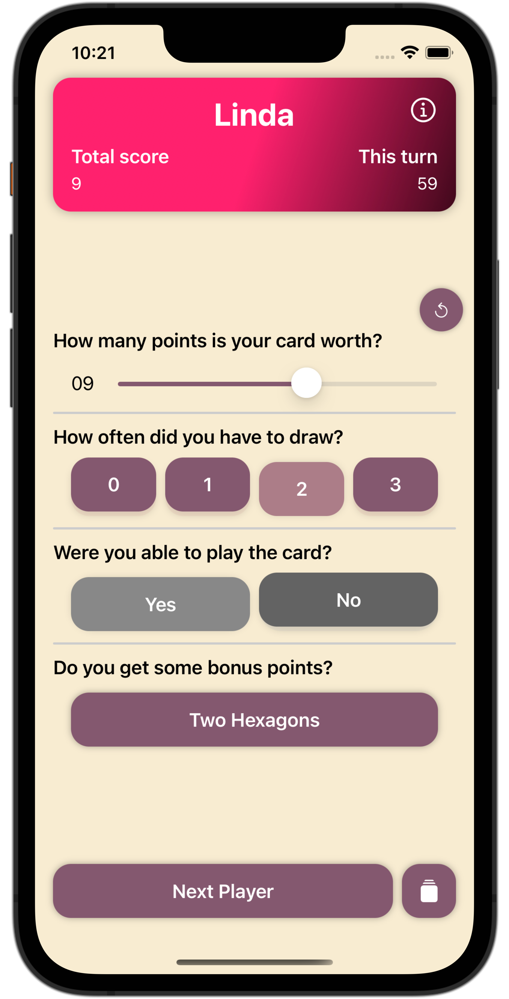

    

# TriomiCount
This is my first real project, expandes while learning.
TriomiCount is used to track the state of the games while playing the boardgame [Triominoes](https://en.wikipedia.org/wiki/Triominoes).

It basically is a kind of dominoes but with triangle shaped tiles.

Me and my wife like playing the game, but I was annoyed that I'd to write down our scores by hand and the next time we'd played, the last scores were gone. Also I was looking for a simple app for learning purpose.
I learn a lot better when building something, than rebuild the next to-do app or just follow tutorials.

## Key features
* track a game of *n* player
* add and list players
* show statistics about single players *(e.g. highscores, last score, games played, games won, etc.)*
* look into previous games and its statistics *(work in progress)*

## To-do
- [x] ~~'undo' last turn in a session~~
- [x] ~~prevent display from dimming / turning off~~
    - [x] ~~make it a setting~~
- [ ] get some kind of chart into player and session statistics
- [ ] give players the possibility to add a profile picture or atleast an emoji for the beginning
    - [ ] work this into the gameView
- [x] ~~some kind of quicklook feature in session (*maybe with tap on the header?*)~~
- [x] feature: favorite color of player, choose on creating, edit in PlayerDetailView
- [x] ~~color the GameView into player's favorite color?~~

## Screenshots

  
  
  
  

## Credits
* Font used in logo is 'Photograph Signature' by [typeline](https://creativemarket.com/typeline)
* Used Packages and helper tools:
    * [SFSafeSymbols](https://github.com/SFSafeSymbols/SFSafeSymbols)
    * [Swiftgen](https://github.com/SwiftGen/SwiftGen)

## Requirements
* Xcode 13.0+ & Swift 5.5+
* iOS 15.0+

## License
The project is licenced under [GNU General Public License version 2](./LICENSE).
